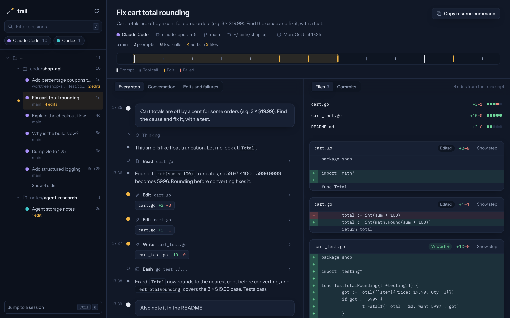

# trail

See what your coding agents did, folder by folder.



trail finds the session logs that Claude Code and Codex leave on your machine, files each session under the project it ran in, and shows the transcript next to the changes it made. Click an edit in the transcript to jump to its diff; click a diff to jump back to the step that made it. A Commits tab lists what landed in git while the session ran, with the commits that touch the agent's files first.

Each session opens with a trace: one tick per step, prompts tall, edits amber, failures red. Drag across it to move through the transcript. Press ⌘K (Ctrl+K) to jump to any session, `/` to filter the sidebar, and `j`/`k` to step between sessions.

It’s a single static Go binary with an embedded browser UI (fonts included, nothing loads from the network). It only reads agent storage, never writes to it.

## Install

Download the archive for your machine from [Releases](https://github.com/veluribharath/trail/releases/latest), unpack it, and run `./trail`. Builds are published for macOS (Apple Silicon and Intel) and Linux (x86_64 and ARM64).

```
tar -xzf trail_*_darwin_arm64.tar.gz
xattr -d com.apple.quarantine ./trail   # macOS only: the binary isn't signed
./trail -open
```

With Go 1.24 or newer:

```
go install github.com/veluribharath/trail@latest
```

From source:

```
git clone https://github.com/veluribharath/trail && cd trail
make build
```

## Run it

```
./trail            # http://127.0.0.1:7878
./trail -open      # and open the browser
./trail -list      # print sessions by folder and exit
```

On a remote dev box, `./trail -host 0.0.0.0` and open the port from your laptop. Transcripts often contain secrets, so only do this on a network you trust (or tunnel the port over SSH instead).

| Flag | Default |
| --- | --- |
| `-host` | `127.0.0.1` |
| `-port` | `7878` |
| `-claude-dir` | `$CLAUDE_CONFIG_DIR` or `~/.claude` |
| `-codex-dir` | `$CODEX_HOME` or `~/.codex` |

## What it reads

| Agent | Location | Edits shown as diffs |
| --- | --- | --- |
| Claude Code | `~/.claude/projects/<folder>/<id>.jsonl` | `Edit`, `MultiEdit`, `Write` |
| Codex | `~/.codex/sessions/YYYY/MM/DD/rollout-*.jsonl` (current and legacy formats) | `apply_patch`, direct or through the shell tool |

Sessions are filed under their git repository. A session that ran in a linked worktree is filed under the main repository and labelled with the worktree. Folders that aren't repositories are filed as themselves.

## How diffs and commits are matched

The Edits tab comes straight from the transcript: each change is the before/after text the agent sent to its edit tool, so it is exact for that step. A Claude Code `Write` replaces the whole file, and the transcript doesn't say what was there before, so every line shows as added.

The Commits tab runs `git log --all` in the session's folder for a window from 10 minutes before the session started to 2 hours after it ended. A commit "touches" the session when it changes a file the transcript edited. This is a heuristic: a commit in the window by someone else that touches the same file will also match.

## Layout

```
main.go      flags, startup, -list
model.go     Session, Transcript, Event, FileChange
claude.go    Claude Code adapter
codex.go     Codex adapter and apply_patch parser
index.go     discovery, mtime cache, repo-root grouping
git.go       commits in the session window
server.go    JSON API and embedded UI
web/         index.html, style.css, app.js (no build step)
```

Adding an agent means implementing `Provider` (four methods) and registering it in `main.go`.

## Not yet

- OpenCode (SQLite storage), Gemini CLI, Kiro, pi
- Renaming sessions from trail (names are read from Claude Code and Codex, never written)
- Full-text search across transcripts (the filter covers titles, first prompts, folders and branches)
- Live tailing of a running session

## Contributing

Issues and pull requests are welcome. See [CONTRIBUTING.md](CONTRIBUTING.md) for setup and the few ground rules (trail stays read-only, and test fixtures must never be real transcripts). To report a security problem privately, see [SECURITY.md](SECURITY.md).

## License

[MIT](LICENSE). The embedded fonts, Instrument Sans and IBM Plex Mono, are under the SIL Open Font License; their licenses are in `web/fonts/`.
